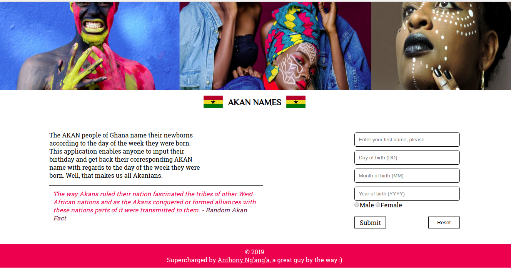

# AKAN NAMES PROJECT

### PROJECT DESCRIPTION

---

The Akan are a community in Ghana. They name their newborns according to the day of the week they were born. This app enables anybody to enter their birth date and it gives them the Akan equivalent.

---

### AUTHOR

---

Anthony Ng'ang'a - Web Architect. I'm passionate about the web and love to create great things for it.

---

### BDD

---

- User enters his/her first name, followed by the date they were born.
- If a user enters wrong information, they see an error message with a red background.
- A user then presses submit. The Akan name appears on top with a green background.

---

### TECHNOLOGIES USED

---

- HTML5
- CSS3

---

CONTACT INFORMATION

---

For any questions and cpomments, please email me at ngash.anto@gmail.com

---

## LICENSE INFORMATION

The MIT License (MIT)

Copyright (c) 2019 Anthony Ng'ang'a

Permission is hereby granted, free of charge, to any person obtaining a copy of this software and associated documentation files (the "Software"), to deal in the Software without restriction, including without limitation the rights to use, copy, modify, merge, publish, distribute, sublicense, and/or sell copies of the Software, and to permit persons to whom the Software is furnished to do so, subject to the following conditions:

The above copyright notice and this permission notice shall be included in all copies or substantial portions of the Software.

THE SOFTWARE IS PROVIDED "AS IS", WITHOUT WARRANTY OF ANY KIND, EXPRESS OR IMPLIED, INCLUDING BUT NOT LIMITED TO THE WARRANTIES OF MERCHANTABILITY, FITNESS FOR A PARTICULAR PURPOSE AND NONINFRINGEMENT. IN NO EVENT SHALL THE AUTHORS OR COPYRIGHT HOLDERS BE LIABLE FOR ANY CLAIM, DAMAGES OR OTHER LIABILITY, WHETHER IN AN ACTION OF CONTRACT, TORT OR OTHERWISE, ARISING FROM, OUT OF OR IN CONNECTION WITH THE SOFTWARE OR THE USE OR OTHER DEALINGS IN THE SOFTWARE.
